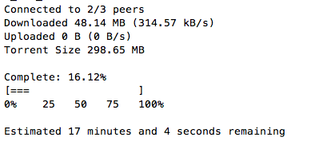

# Zaujímavé JavaScript aplikácie 

- normit
- torrent - Download torrents from the command line
- MySportsFeeds

## normit
<https://www.npmjs.com/package/normit>

Nástroj na prekladanie viet priamo v termináli
### Ukážka aplikácie
Inštalácia:

    npm install normit -g
Použitie:

	normit 'source_language'  'target_language'  'text'

Príklady:

	normit en es "hey cowboy where is your horse?"
	=>  "Hey vaquero dónde está tu caballo?"

	normit fr en "qui est votre papa?"
	=>  "Who's Your Daddy?"

### Charakteristika
//TODO: Doplniť technológie

## torrent
<https://github.com/maxogden/torrent>

Umožòuje sťahovať torrenty cez príkazový riadok. Staèí pridať cestu k .torrent súboru, alebo cestu na magnet link.
Tiež vie vytvárať a seedovať torrenty.

### Ukážka aplikácie

	 torrent subor.torrent

 Poèas sťahovania vypisuje progress:

	1 file(s) in torrent
	ubuntu-14.04.iso
	Connected to 35/37 peers
	Downloaded 5.47 MB (1.09 MB/s) with 0 hotswaps
	Uploaded 0 B (0 B/s)

### Charakteristika
//TODO: Doplniť technológie

## MySportsFeeds
<https://www.npmjs.com/package/mysportsfeeds-node>

Api na získavanie športových dát. Má k dispozícii real-time, ale aj historické data napr. z NHL alebo NBA

### Ukážka aplikácie
Najprv je potrebná autentifikácia

	msf.authenticate("<YOUR_API_KEY>", "MYSPORTSFEEDS");
Následne môžeme posielať requesty napr. (Všetky NBA 2016-2017 zápasy, v ktorých hral Stephen Curry, v JSON formáte):

	var data = msf.getData('nba', '2016-2017-regular', 'player_gamelogs', 'json', {player: 'stephen-curry'});

	
### Charakteristika
//TODO: Doplniť technológie
